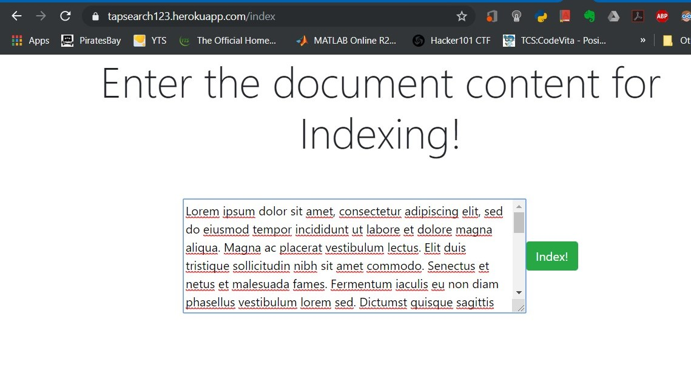
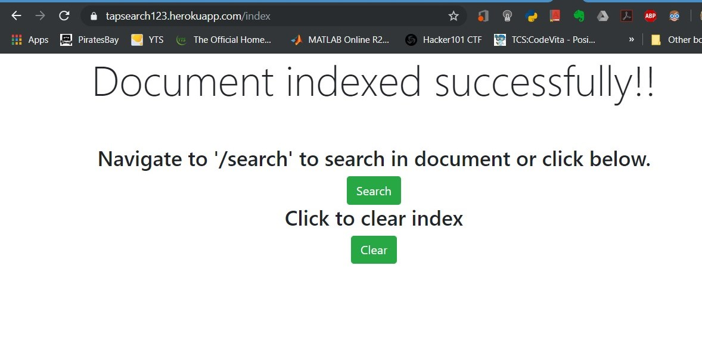
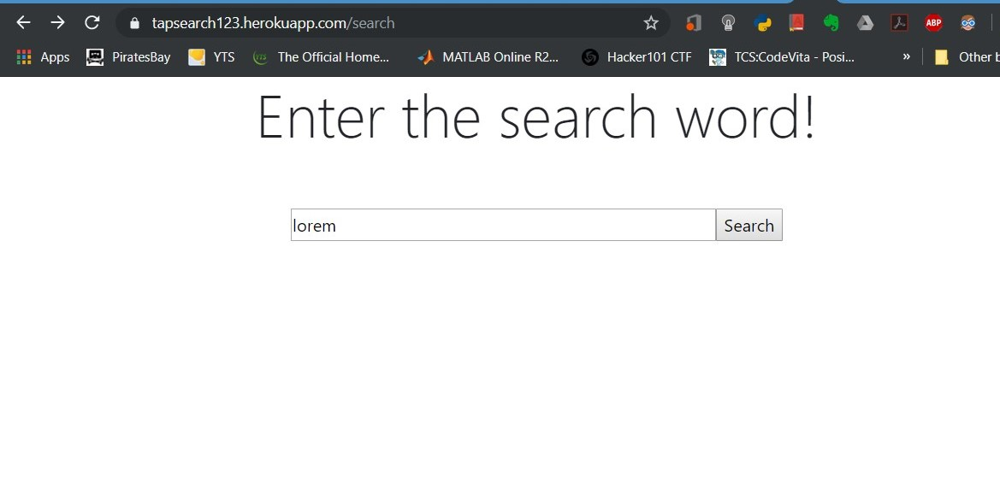
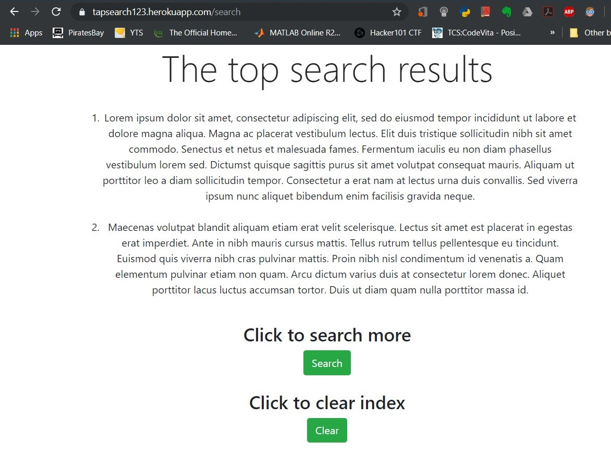
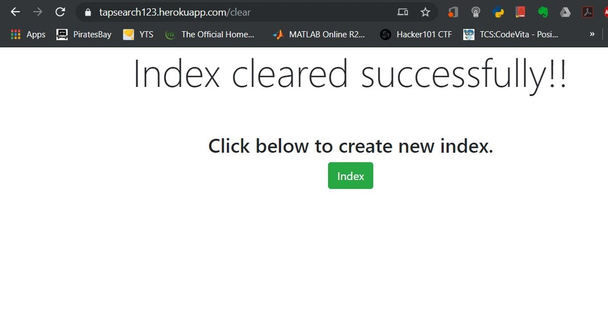

# TapSearch
 To search for words in documents using Inverted Index

Follow the steps to see the application's working:

1. Navigate to the url https://tapsearch123.herokuapp.com/index to input the documents to be indexed. A sample is shown in below figure.

2. Next enter the documents and click **Index**.

3. Documents once indexed will be acknowledged as shown below.

4. Navigate to **/search** to search for a word in document using inverted index. Enter the word and click **Search**.

5. Results will be shown with minimilastic UI as shown in the below image.

6. To cleare the Index and document ID's, navigate to **/clear** or click **clear**.

